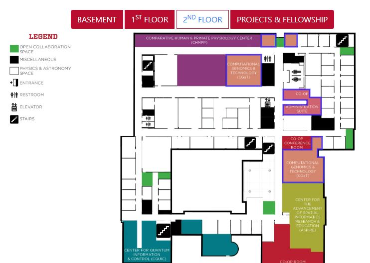

# paisCoop

This is the website developed for the UNM Interdisciplinary Science Cooperative’s Virtual Open House.

It was built separately on [Foundation](https://get.foundation/index.html) and [BootStrap](https://getbootstrap.com/), and used [ImageMapster](https://jamietre.github.io/ImageMapster/) to activate HTML image maps so you can highlight and select them.

[Try it out!](https://hfchen20.github.io/paisCoop/)

<ul>
  <li><a href="foundation6/index.html" target="_blank">Foundation 6<a></li>
  
  <li><a href="bootstrap3/index.html" target="_blank" >Bootstrap 3</a></li>
  
  <li><a href="bootstrap5/index.html" target="_blank" >Bootstrap 5</a></li>
<ul>

